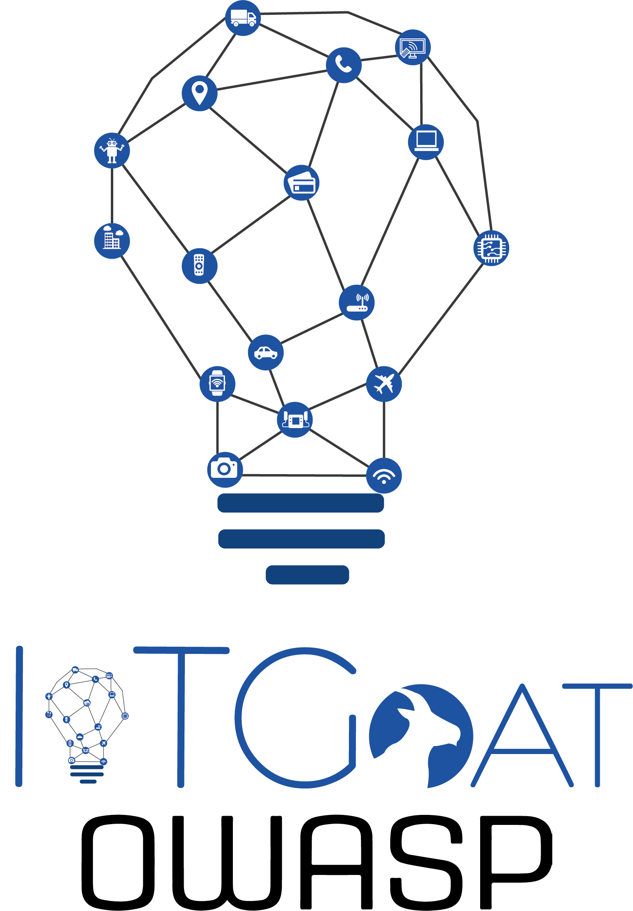

<p align="center">
  
</p>

# IoTGoat Security Writeups
...


This repository contains my personal writeups and security research while working through **[OWASP IoTGoat](https://github.com/OWASP/IoTGoat)**.

IoTGoat is a deliberately vulnerable firmware based on OpenWrt and maintained by OWASP as a practical environment for learning and testing common vulnerabilities found in IoT devices.

The goal of this repository is to document my approach to IoT security through both **static firmware analysis** and **dynamic penetration testing**, from initial reconnaissance and firmware extraction to exploitation and root access.

---

## Objectives

Throughout these writeups, I will document the process of:

* Performing static analysis of IoT firmware
* Extracting and analyzing embedded filesystems
* Identifying weak and hardcoded credentials
* Analyzing configuration files and embedded binaries
* Performing network reconnaissance and service enumeration
* Identifying insecure network services
* Analyzing web interfaces and exposed services
* Identifying outdated and vulnerable components
* Performing post-exploitation enumeration
* Discovering backdoors and insecure configurations
* Investigating privilege escalation paths
* Obtaining root access where applicable
* Mapping vulnerabilities to the **OWASP IoT Top 10**
* Documenting the methodology, commands, evidence, and findings for each attack path

---

## Methodology

The exercises are approached from both **static** and **dynamic** perspectives.

### Static Analysis

The firmware is analyzed offline to understand its internal structure, configuration, credentials, binaries, and potential vulnerabilities.

Typical workflow:

```text
Firmware Image
      │
      ├── File Identification
      ├── Filesystem Extraction
      ├── Configuration Analysis
      ├── Credential Discovery
      ├── Binary Analysis
      ├── Strings / Metadata
      └── Vulnerability Research
```

Tools used may include:

* `binwalk`
* `strings`
* `grep`
* `find`
* `file`
* `John the Ripper`
* Python
* Other firmware analysis utilities

### Dynamic Analysis

The IoTGoat environment is also analyzed while running to identify exposed services, vulnerabilities, and potential attack paths.

Typical workflow:

```text
Running IoTGoat
      │
      ├── Network Discovery
      ├── Port Scanning
      ├── Service Enumeration
      ├── Web Testing
      ├── Authentication Testing
      ├── Local Enumeration
      ├── Process Analysis
      └── Privilege Escalation
```

Tools used may include:

* `nmap`
* `netcat`
* `ssh`
* `curl`
* VirtualBox
* Linux / BusyBox utilities
* Additional tools depending on the challenge

---

## OWASP IoT Top 10

Where applicable, each writeup will identify the relevant **OWASP IoT Top 10** category.

| ID  | Category                                |
| --- | --------------------------------------- |
| I1  | Weak, Guessable, or Hardcoded Passwords |
| I2  | Insecure Network Services               |
| I3  | Insecure Ecosystem Interfaces           |
| I4  | Lack of Secure Update Mechanism         |
| I5  | Use of Insecure or Outdated Components  |
| I6  | Insufficient Privacy Protection         |
| I7  | Insecure Data Transfer and Storage      |
| I8  | Lack of Device Management               |
| I9  | Insecure Default Settings               |
| I10 | Lack of Physical Hardening              |

---

## Writeups

### 01 — Firmware Analysis to Root

**Status:** Completed

This writeup covers an end-to-end IoTGoat penetration testing workflow, including:

* Firmware extraction with `binwalk`
* Static filesystem analysis
* Credential hash extraction
* Targeted password dictionary generation
* Credential cracking with John the Ripper
* IoTGoat x86 virtual machine setup
* Network reconnaissance with Nmap
* SSH access using recovered credentials
* Post-exploitation enumeration
* Discovery and analysis of a hardcoded backdoor
* Root shell acquisition
* Identification of outdated `dnsmasq`
* Mapping findings to the OWASP IoT Top 10

**Writeup:** [`01-firmware-analysis-to-root.md`](./01-firmware-analysis-to-root.md)

---

## Repository Structure

```text
.
├── README.md
├── 01-firmware-analysis-to-root.md
├── 02-...
├── 03-...
└── ...
```

Each writeup will document a specific challenge or attack path and may include:

* Initial reconnaissance
* Methodology
* Tools and commands
* Vulnerability identification
* Exploitation
* Evidence
* Post-exploitation
* OWASP IoT Top 10 mapping
* Lessons learned

---

## Lab Environment

The exercises are performed in an isolated lab environment using intentionally vulnerable IoTGoat firmware.

Depending on the exercise, the lab may include:

* Kali Linux
* VirtualBox
* IoTGoat x86 VM
* IoTGoat firmware images
* Host-only networking
* Additional analysis tools

The official IoTGoat project can be found here:

**https://github.com/OWASP/IoTGoat**

---

## Disclaimer

This repository is intended for **educational and authorized security testing purposes only**.

IoTGoat is intentionally vulnerable and designed as a security training platform. The techniques documented here should only be used against systems, devices, and applications for which you have explicit authorization to test.

---

## References

* [OWASP IoTGoat](https://github.com/OWASP/IoTGoat)
* [OWASP Internet of Things Project](https://owasp.org/www-project-internet-of-things/)
* [OWASP IoT Top 10](https://owasp.org/www-project-internet-of-things/)

---

> **Learning by breaking things — and documenting how they can be fixed.**
